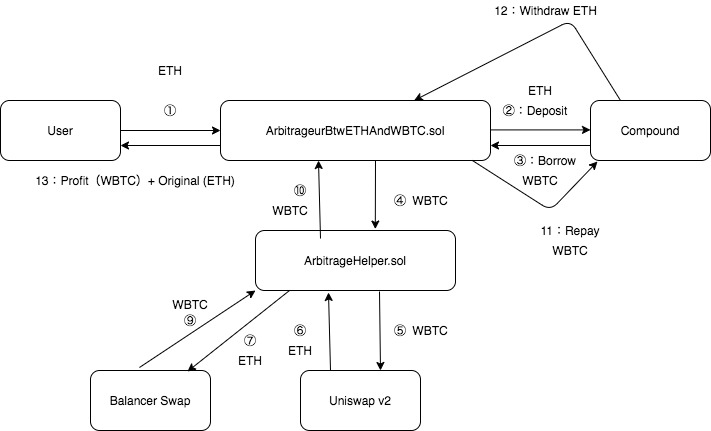

# FlashBoyz⚡: Intra-blockchain arbitrage smart contract 

## Description

A flash loan is a type of instant loan available in the context of blockchain-based decentralized finance (DeFi). It is a mechanism that allows users to borrow large amounts of cryptocurrencies without the need to provide collateral or have sufficient capital in their account.

The distinguishing feature of a flash loan is that the loan must be repaid in the same block of transactions in which it is requested. This means that the user must be able to use the loan to execute trades or arbitrage strategies within a single transaction, and then repay the loan amount plus any interest or fees in the same transaction.

The main advantage of a flash loan is that it allows users to temporarily exploit large sums of cryptocurrencies without having to commit their capital. This opens up possibilities for arbitrage and algorithmic trading strategies that may not be possible otherwise.

However, it is important to note that the loan must be repaid in the same transaction. If the loan is not repaid, the entire transaction is canceled and all operations carried out within the transaction are cancelled. This ensures that there is no risk of default or loss for the loan provider.

Flash loans have become popular within the DeFi ecosystem as they allow users to get instant liquidity to execute complex trades without having to have substantial capital. However, they require careful planning and a solid understanding of usage strategies to avoid loss or risk.

### Example of Flash loan strategy

https://cryptopotato.com/defi-flashloands-how-someone-made-16000-with-zero-investment/

First, he borrowed 2,048,000 USDCT using dYdX’s flash loan. Remember, because it’s a flash loan, he doesn’t have to post any collateral as long as he repays the amount within the same block.

He then swapped this amount for 2,028,367 DAI on Curve y pool. After that, he swapped the DAI for 2,064,182 USDC on Curve’s SUSD pool, and lastly, he paid back the 2,048,000 USDC to dYdX, all within the same block.

All of this is possible because of the different stablecoin rate at the various lending protocols. And while 1% difference might not seem like a lot, when one is able to borrow high amounts and arbitrage this difference, the profits can be substantial.

### Uniqueness of the transaction
What’s unique about flash loans is that the loan is not granted on the basis of the borrower’s profile, documents or collateral (as with traditional finance and even some loans in DeFi) but instead, on the borrower’s ability to prove an immediate yield from the transaction, based on the smart contract they’ve created.

If X+10 can be repaid within seconds – something that will depend on the specifics of the arbitrage opportunity itself – then X can be borrowed right now.

Hence, to be able to access and receive a flash loan, you need to spot a price discrepancy and immediately write a contract to fit, before the gap closes.

### Smart contract

Smart contracts are self-executing digital agreements that allow us to interact with other users and platforms remotely, without a middleman. But they are unambiguous, and once you sign one, it cannot be reversed.

 Lack of understanding about how to read smart contracts is a key vector for scams – so knowing how to read them is an essential competence for anyone operating in the crypto space.
 
 You can do this by learning how to read information about a smart contract on blockchain explorers such as Ehterscan.

To verify the authenticity of the smart contract system each node independently verifies the block by comparing the state changes with the available local copy of the block. If the state changes are deterministic, the transactions are approved by the participating nodes of the blockchain. Consequently, in a situation where the nodes couldn’t come to a consensus, the execution of the block halts and the network may halt.

For the continuous execution of smart contracts on a blockchain network, the contract must be deterministic, where the nodes continuously validate the conditions to be met for the smart contract.

Smart contracts are handy tools that allow asset transfer and conditional fulfillment digitally. They solve the issue of mutual trust, transparency, global communication and economics. Here are some revolutionary real-world applications of smart contracts:

    - The execution of transactions including legal processes.
    
    - The execution of transactions relating to the insurance industry.
    
    - The execution of crowdfunding agreements and ICO campaigns.
    
    - The execution of transactions related to trading, financial derivatives, and simple asset exchange and transfers.

### Read a smart contract in etherscan
In the below sections will walk you through the process of

1. Finding a smart contract

2. Reading basic details such as creator address, token name, tokens held in the contract and so on.

3. Understanding the statistics of a contract’s tokens and what they convey.

4. Searching and understanding the transactions that have happened through a smart contract. 

5. Finding the source code of a contract for deeper analysis.

So, if a smart contract has 10 million tokens, but 4 million of those are owned by just one wallet, the project’s future can be heavily impacted by just one player, and that risk needs to be factored into your projections.

You can further click on “Holders” in the below section, and it will display the rank of all token holders based on the percentage of the total token supply they hold. The more diversified the supply, the more distributed the project is, and the safer the token is from pump and dump practices.

### Contract Transactions

Another way to build a picture of a project’s legitimacy is by looking at its token transaction history. If a project has processed many transactions using its native token over a long period of time, this supports the notion that the project has been running a while already, has an active user base, and suggests you’ll be able to gain some insight about its activity and success from looking at other metrics.

Conversely, if all the transactions have taken place recently, or predominantly feature the same wallet addresses, you may want to do some more research about the project, since this doesn’t give any real insight into its story, activity or user engagement.

Where a protocol does not publish their source codes for public review, it’s not necessarily a sign that the contract is a scam – but it is a pretty essential piece of data that you don’t have access to, and that needs to be factored into your decision.

### Limited to Tech-savvy Traders (for now)

As you now know, flash loans are basically smart contracts created for your own specific circumstances – and since smart contracts are basically code executed on the blockchain, you may want to brush up on your coding skills before you get started. If you are feeling antsy to learn about smart contracts here’s a guide on how to read smart contract data.

### A Playground for bots

The autonomy made possibly by flash loans is one of the most exciting elements of the technology – you can literally create your very own, bespoke loan contract. But with a process that’s so easy to automate, the space is also fertile ground for bots. Some bots have been designed to parse the DeFi landscape to detect arbitrage opportunities as they arise, seizing the opportunity immediately. Short story? Don’t expect money-making opportunities to flood in; many are seized up straight away by automated systems, meaning sparse options for regular traders.

### Conclusion

The flash loan is an exciting, but still nascent DeFi innovation that unites olf-fashioned arbitrage with the speed and digital sovereignty of blockchain technology. They may be a bit complex for the average trader, but their underlying premise demonstrates the incredible potential of smart contracts for those who are literate in their programming language. 

## AAVE Flash Loans
  - https://docs.aave.com/developers/guides/flash-loans

## Development tools

  - https://eth-brownie.readthedocs.io/en/stable/
  - https://trufflesuite.com/
  - https://github.com/vyperlang/vyper
  - https://github.com/HypothesisWorks/hypothesis/tree/master/hypothesis-python
  - https://hyperledger-fabric.readthedocs.io/en/latest/whatis.html

## DEX Decentralized Exchanges

  - https://swap.defillama.com/
  - https://uniswap.org/
  - https://openocean.finance/
  - https://rango.exchange/
  - https://gmx.io/
  - https://dydx.exchange/

## Related projects

  - https://github.com/ExtropyIO/defi-bot
  - https://github.com/patrykq9/Metamask-Arbitrage-Trading-Bot
  - https://github.com/f4T1H21/Arbitrage-Bot-Code-Library#documentation
  - https://github.com/bancorprotocol/fastlane-bot#readme
